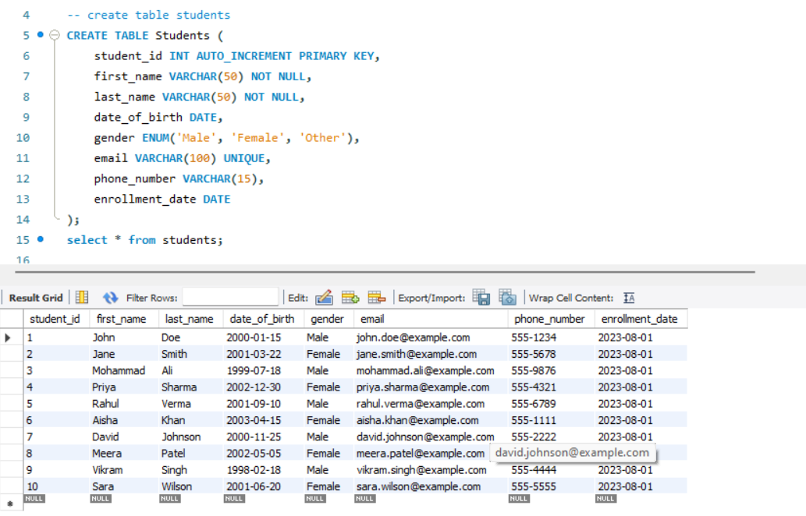
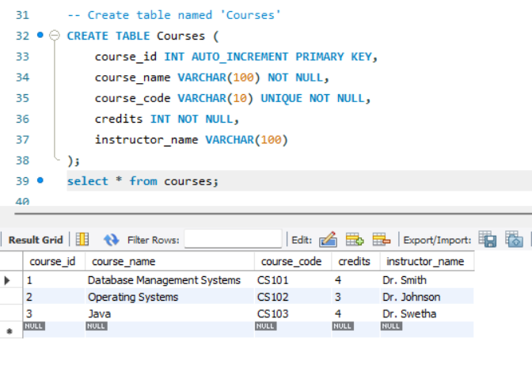
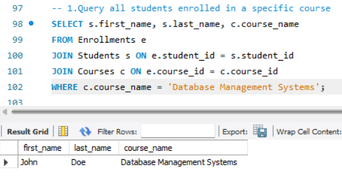

# StudentManagementSystem  
**Name:** Mohammad Muzzamil    
**Company:** CODTECH IT SOLUTIONS    
**ID:** CT08DS7124    
**Domain:** SQL    
**Duration:** August to September 2024  

# **Overview Of The Project**    
**Project**: Student Database Management System  
  
**Objective**  
The Student Management System aims to efficiently manage and streamline the academic processes related to student enrollment, course management, and performance tracking. It provides an integrated platform for storing and retrieving student information, managing course registrations, recording grades, and tracking attendance, enabling educational institutions to enhance administrative productivity and ensure seamless communication between students, instructors, and administrators.  

**Key Activities:**  
**Student Enrollment and Course Registration:** Manage student information, including personal details, and facilitate course selection and enrollment based on course availability and prerequisites.

**Grade and Performance Tracking:** Record, store, and access student grades across different courses, ensuring that both students and administrators can track academic progress throughout the term.

**Attendance Monitoring:** Track student attendance for each class session, allowing educators and administrators to monitor attendance patterns and generate reports.

**Sample query Images**

1.  

   
2.  
    
3.  
  

